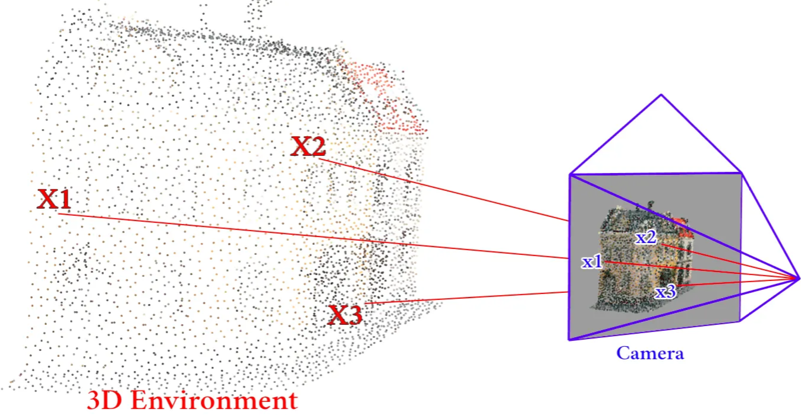
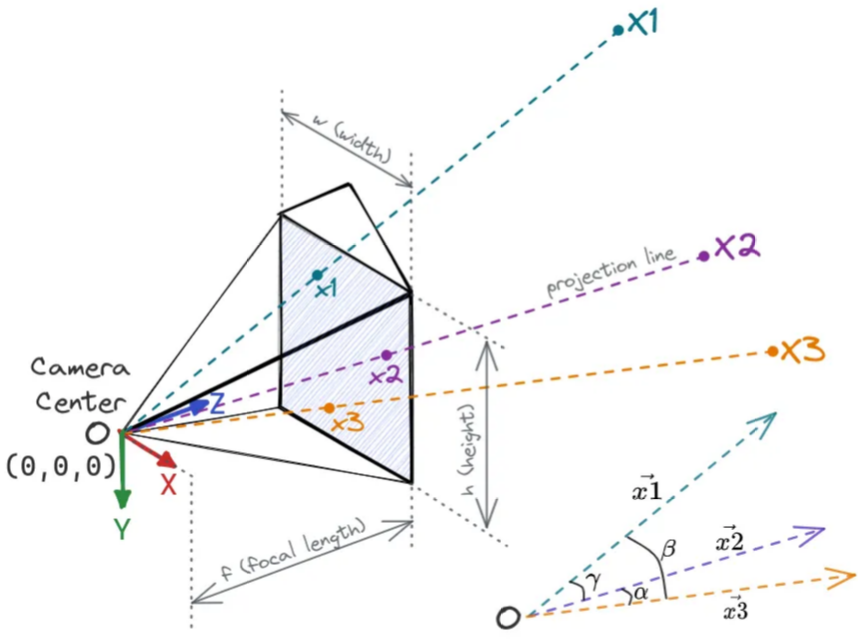
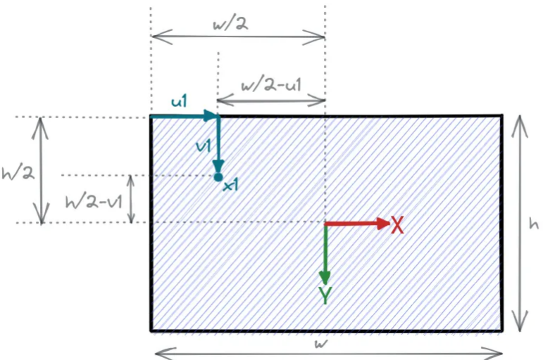
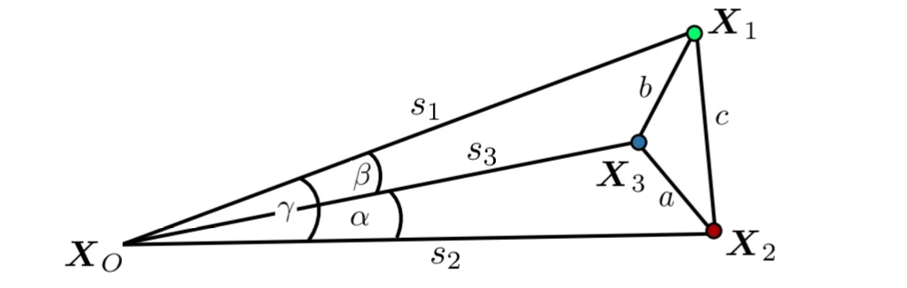
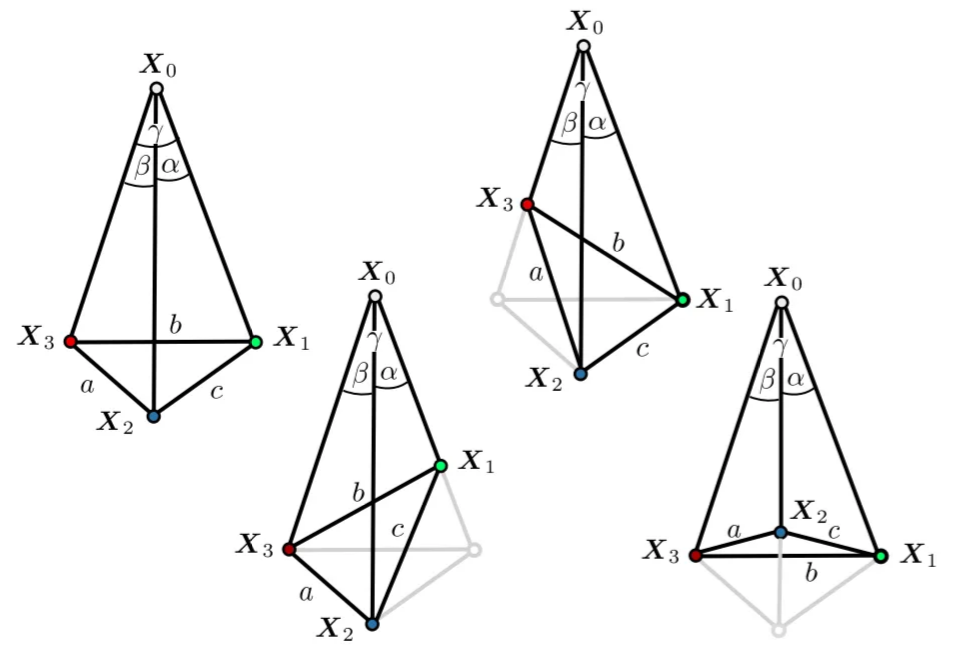

# 📷 Perspective-n-Point (PnP) Tutorial

A detailed discussion on PnP.

## Resources
- 2004
  - [Multiple View Geometry in Computer Vision — Richard Hartley & Andrew Zisserman](https://www.r-5.org/files/books/computers/algo-list/image-processing/vision/Richard_Hartley_Andrew_Zisserman-Multiple_View_Geometry_in_Computer_Vision-EN.pdf)
  - [Presentation](https://www.youtube.com/watch?v=N1aCvzFll6Q) and [slides](https://www.ipb.uni-bonn.de/html/teaching/photo12-2021/2021-pho1-23-p3p.pptx.pdf) by **Prof. Cyrill Stachniss**
  - [Blog post by Jingnan Shi](https://jingnanshi.com/blog/pnp_minimal.html)
  - [Lecture by Prof. Steven LaValle](https://www.youtube.com/watch?v=0JGC5hZYCVE)
  - [PnP Tutorial by Rashik Shrestha](https://medium.com/@rashik.shrestha/perspective-n-point-pnp-f2c7dd4ef1ed)

## Introduction

Imagine you took an image of your house and showed it to your friend, and asked a simple question:

> “Can you tell me where this photograph is taken from?”

Will your friend be able to guess the spot?
If yes, then how?
How does our brain figure out the **location of the camera** just by looking at the image?

Well, this is a well-known problem in **Photogrammetry**, known as the **Perspective-n-Point (PnP)** problem.

---

## What Is PnP?

PnP is the problem of **estimating the relative pose of the camera** with respect to the environment,
given the **point correspondences** between the environment and the image.

---

### Let’s break it down

* **Pose** → Position and orientation of the camera in the environment.
* **Relative** → Because we need a reference coordinate system to define the camera’s pose.

  > Example: “The camera is 2 meters in front of the main door and inclined 45° upward from the ground.”
* **Point correspondences** → Which part of the 3D world corresponds to which part of the 2D image.

---

  
   
  <em>Figure 1: Point correspondences between 3D environment and camera image.</em>

The figure above shows how an image of a 3D environment is captured by a camera.
Here, the 3D points **X₁, X₂, X₃** correspond to 2D image points **x₁, x₂, x₃**.

Finding these correspondences seems intuitive for humans, but it’s a **big challenge for computers**.

> 👉 *[Click here to try an interactive version of this figure](https://rashik.info.np/pnp_in_svg/)*

---

Basically, if we are given enough point correspondences, we can mathematically find the camera pose.
But how much is enough?

Math says: only **three perfect point correspondences** are enough to recover the camera pose.
Hence, **PnP → P3P** problem.

---

## Why Exactly 3 Points?

This has something to do with **Degrees of Freedom**,
which is well explained in this Video:

---

## 🧮 Problem Formulation

Let’s discuss the case of **P3P** and properly define the problem.

**Given:**

* 3D points { X₁, X₂, X₃ }
* Their corresponding 2D image points { x₁, x₂, x₃ }
* Focal length of the camera *f*

**Find:**

* 3D translation vector of the camera (**t**)
* 3×3 rotation matrix of the camera (**R**)

> **Note:**
> We assume an *ideal pinhole camera* (no lens distortion)
> and the **principal point** is exactly at the image center.

---

## 🔢 Solution Steps

To simplify the process, let’s break it into **four main steps**:

1. Compute angles between projection rays
2. Compute lengths of projection rays
3. Identify the correct solution
4. Compute the pose
---

### 1️⃣ Compute Angles Between Projection Rays

**Given:** Image points { x₁, x₂, x₃ } and focal length *f*
**Find:** Angles between projection rays { α, β, γ }

  
   
  <em>Figure 2: Image formation in Pin Hole camera model.</em>

Assume everything is defined in the **camera coordinate system**, with the camera at **(0, 0, 0)** facing the +Z axis.

  
   
  <em>Figure 3: Coordinates in the Image Plane.</em>

Here,

$$
\vec{x}_1 = (u_1 - \tfrac{w}{2},\, v_1 - \tfrac{h}{2},\, f) - (0,0,0)
$$

\[
\therefore \vec{x}_1 = (u_1 - \tfrac{w}{2},\, v_1 - \tfrac{h}{2},\, f)
\]

Similarly, we can find $\vec{x}_2$ and $\vec{x}_3$ as well. Now, the angle between any two vectors can be calculated as:

$$
\alpha = \arccos\!\left(\frac{\vec{x}_2 \cdot \vec{x}_3}{|\vec{x}_2|\,|\vec{x}_3|}\right)
$$

$$
\beta = \arccos\!\left(\frac{\vec{x}_3 \cdot \vec{x}_1}{|\vec{x}_3|\,|\vec{x}_1|}\right)
$$

$$
\gamma = \arccos\!\left(\frac{\vec{x}_1 \cdot \vec{x}_2}{|\vec{x}_1|\,|\vec{x}_2|}\right)
$$

---

### 2️⃣ Compute Lengths of Projection Rays

**Given:** Angles { α, β, γ } and 3D points { X₁, X₂, X₃ }
**Find:** Lengths { s₁, s₂, s₃ }

  
   
  <em>Figure 4: Tetrahedron Geometry.</em>

This step deals with the **geometry of tetrahedron X₀–X₁–X₂–X₃**.

First, find relative distances between the 3D points { a, b, c }, using simple Euclidean distance.

$$
a = \lVert \mathbf{X}_3 - \mathbf{X}_2 \rVert
$$

$$
b = \lVert \mathbf{X}_1 - \mathbf{X}_3 \rVert
$$

$$
c = \lVert \mathbf{X}_2 - \mathbf{X}_1 \rVert
$$

To find { s₁, s₂, s₃ }, apply the **Law of Cosines**.

For triangle X₀–X₁–X₂:

$$
s_1^2 + s_2^2 - 2 s_1 s_2 \cos{\gamma} = c^2
$$

Repeat the same for all three faces of the tetrahedron.

$$
\begin{aligned}
a^2 &= s_2^2 + s_3^2 - 2 s_2 s_3 \cos{\gamma} \\
b^2 &= s_3^2 + s_1^2 - 2 s_3 s_1 \cos{\alpha} \\
c^2 &= s_1^2 + s_2^2 - 2 s_1 s_2 \cos{\beta}
\end{aligned}
$$

For simplicity in calculation, we substitute \( u = \frac{s_2}{s_1} \) and \( v = \frac{s_3}{s_1} \).

We get,

$$
s_1^2 = \frac{c^2}{1 + u^2 - 2u \cos{\gamma}} \tag{i}
$$

$$
s_1^2 = \frac{b^2}{1 + v^2 - 2v \cos{\beta}} \tag{ii}
$$

$$
s_1^2 = \frac{a^2}{u^2 + v^2 - 2uv \cos{\alpha}} \tag{iii}
$$

From equation (i) and (ii):

$$
u^2 - \frac{c^2}{b^2} v^2 - 2u \cos{\gamma} + 2 \frac{c^2}{b^2} v \cos{\beta} + \frac{b^2 - c^2}{b^2} = 0 \tag{iv}
$$

From equation (ii) and (iii):

$$
u^2 = -\frac{b^2 - a^2}{b^2} v^2 + 2uv \cos{\alpha} - \frac{2a^2}{b^2} v \cos{\beta} + \frac{a^2}{b^2} \tag{v}
$$

Substituting the value of \( u^2 \) from equation (v) into equation (iv):

$$
u = \frac{(-1 + \frac{a^2 - c^2}{b^2})v^2 - 2\left(\frac{a^2 - c^2}{b^2}\right)v \cos{\beta} + (1 + \frac{a^2 - c^2}{b^2})}
{2(\cos{\gamma} - v \cos{\alpha})} \tag{vi}
$$

Here, we have completely isolated the term \(u\) from others which can be plugged back into equation (iv) to get:

$$
A_4 v^4 + A_3 v^3 + A_2 v^2 + A_1 v + A_0 = 0 \tag{vii}
$$

where,

$$
A_4 = 
\left( \frac{a^2 - c^2}{b^2} - 1 \right)^2 
- \frac{4 c^2}{b^2} \cos^2{\alpha}
$$

$$
A_3 = 4 \left[
\frac{a^2 - c^2}{b^2}
\left( 1 - \frac{a^2 - c^2}{b^2} \right) \cos{\beta}
- \left( 1 - \frac{a^2 + c^2}{b^2} \right) \cos{\alpha} \cos{\gamma}
+ 2 \frac{c^2}{b^2} \cos^2{\alpha} \cos{\beta}
\right]
$$

$$
\begin{aligned}
A_2 = 2 \Bigg[
&\left( \frac{a^2 - c^2}{b^2} \right)^2 
- 1 + 2 \left( \frac{a^2 - c^2}{b^2} \right)^2 \cos^2{\beta}
+ 2 \left( \frac{b^2 - c^2}{b^2} \right) \cos^2{\alpha} \\
&- 4 \left( \frac{a^2 + c^2}{b^2} \right)
\cos{\alpha} \cos{\beta} \cos{\gamma}
+ 2 \left( \frac{b^2 - a^2}{b^2} \right) \cos^2{\gamma}
\Bigg]
\end{aligned}
$$

$$
A_1 = 4 \left[
-\left( \frac{a^2 - c^2}{b^2} \right)
\left( 1 + \frac{a^2 - c^2}{b^2} \right) \cos{\beta}
+ \frac{2 a^2}{b^2} \cos^2{\gamma} \cos^2{\beta}
- \left( 1 - \frac{a^2 + c^2}{b^2} \right)
\cos{\alpha} \cos{\gamma}
\right]
$$

$$
A_0 = 
\left( 1 + \frac{a^2 - c^2}{b^2} \right)^2
- \frac{4 a^2}{b^2} \cos^2{\gamma}
$$

Equation (vii) yields a **fourth-degree polynomial**. Solving it gives **four possible values** for *v* which can be substituted into equation (vi) to obtain *u*.

Hence, we get **four sets of (u,v)** values only one of which is correct.

---

### 3️⃣ Identify the Correct Solution

  
   
  <em>Figure 5: Four Possible Solutions.</em>

Geometrically, it’s possible to get **four different sets** of { s₁, s₂, s₃ } for the same angles { α, β, γ } and relative distances { a, b, c }.

**Methods to choose the correct solution:**

1. Use additional sensors like **GPS** or **IMU** to get an initial pose estimate and select the solution nearest to it.
2. Use **more correspondence points** — e.g., add a fourth pair (X₄, x₄).

   * Compute four camera poses using Step 4 below and check which aligns best with X₄.
   * Alternatively, solve for { s₁, s₂, s₄ }, { s₂, s₃, s₄ }, { s₁, s₃, s₄ } and find the set consistent with previous { s₁, s₂, s₃ } values.

---

### 4️⃣ Compute Pose

**Given:** Complete tetrahedron geometry
**Find:** Camera pose — rotation matrix Rc and translation vector tc

We already have { X₁, X₂, X₃ } in both **camera** and **world** coordinate systems. Now we need a **transformation from camera → world coordinates**,
which lets us transform the camera position to obtain the final **camera pose**.

This is a classic **3D registration** (or point-cloud alignment) problem, also known as *scan matching*.

> The author will cover this topic in a future post.
> You can check related works referenced in the article for more ideas.

---

## 💭 Final Thoughts

This post explains one of the earliest variants of the **PnP algorithms**, originally proposed by **Grunert in 1841**.

Centuries later, we have much faster and more robust solutions (e.g., OpenCV’s `solvePnP`, PyPose implementations). Still, understanding the **original geometric formulation**
helps you apply and debug modern methods more effectively

